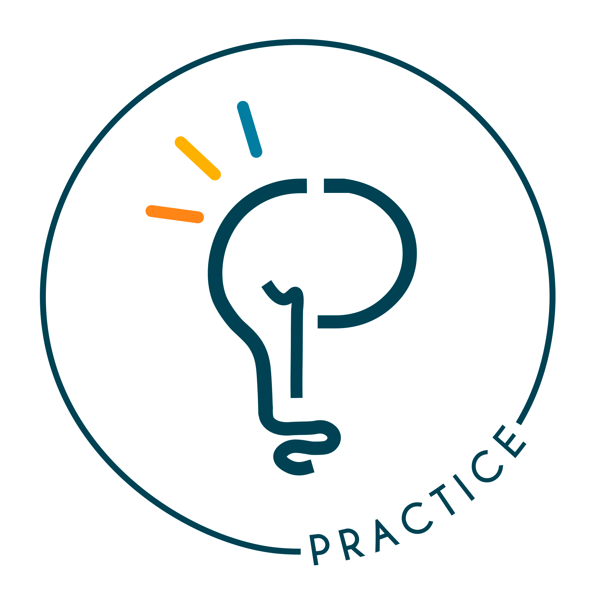

<p align="center">
    <br />
    
    
</p>

<h1 align="center"> Programa PRACTICE </h1>

Este repositório é destinado a todas as movimentações de demandas do programa. Todas as atividades relacionadas a produção de conteudo e demandas organizacionais do PRACTICE estão nas issues do repositório.

> **IMPORTANTE:** coloque aqui alguma mensagem que é muito relevante aos usuários do projeto, se for o caso.

## Features

Aqui você pode colocar uma screenshot do produto resultante desse projeto. Descreva também suas features usando uma lista:

* Fácil integração;
* Poucas dependências;
* Utiliza um template lindo para organizar o `README`;
* Possui ótima documentação e testes.

## Começando

### 1. Primeiro passo para começar

Geralmente o primeiro passo para começar é instalar dependências para rodar o projeto. Rode:

```
apt get install dependencia
```

Recomenda-se que cada comando seja colocado em uma linha diferente:

```
apt get install outra-coisa
```

Dessa forma os usuários podem copiar e colar sem ler as documentação (que é o que geralmente acontece).

### 2. Outro(s) passo(s)

Geralmente os próximos passos ensinam como instalar e configurar o projeto para uso/desenvolvimento. Rode:

```
git clone https://github.com/ccuffs/template template
```

## Contribua

Sua ajuda é muito bem-vinda, independente da forma! Confira o arquivo [CONTRIBUTING.md](CONTRIBUTING.md) para conhecer todas as formas de contribuir com o projeto. Por exemplo, [sugerir uma nova funcionalidade](https://github.com/ccuffs/template/issues/new?assignees=&labels=&template=feature_request.md&title=), [reportar um problema/bug](https://github.com/ccuffs/template/issues/new?assignees=&labels=bug&template=bug_report.md&title=), [enviar um pull request](https://github.com/ccuffs/hacktoberfest/blob/master/docs/tutorial-pull-request.md), ou simplemente utilizar o projeto e comentar sua experiência.

Veja o arquivo [ROADMAP.md](ROADMAP.md) para ter uma ideia de como o projeto deve evoluir.


## Licença

Esse projeto é licenciado nos termos da licença open-source [Apache 2.0](https://choosealicense.com/licenses/apache-2.0/) e está disponível de graça.

## Changelog

Veja todas as alterações desse projeto no arquivo [CHANGELOG.md](CHANGELOG.md).

## Projetos de Desenvolvimento

O PRACTICE também atua no desenvolvimento de softwares voltados para comunidade academica, como o Mural e o APP do programa:

* [Web-Feedback](https://github.com/practice-uffs/web-feedback)
* [Site PRACTICE](https://github.com/practice-uffs/website-programa)
* [APP PRACTICE](https://github.com/practice-uffs/app-practice)
