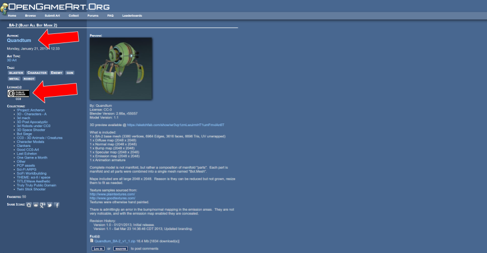
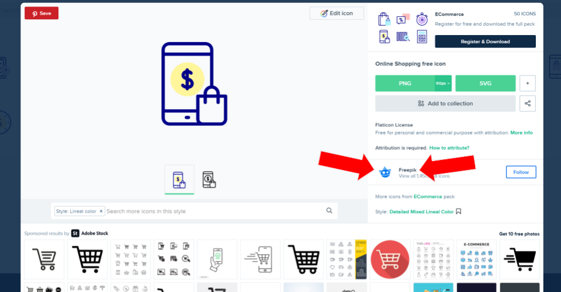

# Introdução

Esse site contém instruções que cada equipe (e seus integrantes) do [PRACTICE](https://practice.uffs.cc) deve seguir para produzir conteúdo. Utilize o menu do lado esquerdo para saber mais sobre um determinado assunto.

# Identidade visual do programa

* [Logos e arquivos em geral](https://drive.google.com/drive/folders/1ymOvitNBOkBeU2RStVchrD6Rg8Ar4FB-)
* [Paleta de cores](https://drive.google.com/file/d/1vo1DDX0zXA8rnZ_tm6VHDU5DzZPV1yOs)

# Links rápidos

### Pastas no Google Drive
* [Pasta de todo programa](https://drive.google.com/drive/folders/1awqYC9rMMGVIrrYheihE5rSf1lHHisJw)
* [Pasta de tarefas](https://drive.google.com/drive/folders/1aBjyA92_IdiPJokAJyBF9HtIKzMIVqvQ)

### Github e controle de projetos
* [Lista de repositórios/projetos do programa no Github](https://github.com/practice-uffs)
* [Repositório principal do programa no Github](https://github.com/practice-uffs/programa)

### Geral
* [Quadro com tarefas da sprint](https://github.com/orgs/practice-uffs/projects/1)
* [Site oficial do programa](https://practice.uffs.edu.br) (provisoriamente é [practice.uffs.cc](https://practice.uffs.cc]))

# Dez mandamentos da equipe

1. **Nunca** usarei materiais que não informam sua licença de uso;
2. Só usarei materiais licenciados como: [domínio público](https://creativecommons.org/share-your-work/public-domain/cc0/) (CC0 ou _public domain_), [CC BY 3.0](https://creativecommons.org/licenses/by/3.0/deed.pt), [CC BY 4.0](https://creativecommons.org/licenses/by/4.0/deed.pt), ou [CC BY-SA 4.0](https://creativecommons.org/licenses/by-sa/4.0/deed.pt);
3. Para cada material que utilizar, anotarei a) fonte/link, b) nome do autor(a) e c) licença;
4. Utilizarei apenas softwares grátis ou de código-aberto para criar conteúdo;
5. _"Se não estiver no Github, isso não existe."_;
6. Tentarei usar formatos de documentos na núvem que outros consigam colaborar ao mesmo tempo comigo, ex.: Google Docs;
7. Colocarei dados, documentos e arquivos no [Google Drive do programa](https://drive.google.com/drive/folders/1awqYC9rMMGVIrrYheihE5rSf1lHHisJw);
8. Farei discussões/questionamentos das tarefas somente via comentários das issues;
9. Usarei WhatsApp/Telegram para agilizar a comunicação, não para substituir discussões nos issues;
10. Participarei das reuniões de sprint todas as sexta-feiras.

# Onde consigo materiais?

## :far fa-image: Fotografias

### [:fas fa-chevron-right: Unsplash](https://unsplash.com/)

As imagens listadas nesse site são domínio público (CC0 ou _public domain_), então elas podem ser usadas livremente, inclusive sem creditar autoria. Por respeito ao trabalho alheio, mencione a fonte como `unsplash.com`.

## :far fa-image: Ilustrações (cartoon)

### [:fas fa-chevron-right: Undraw](https://undraw.co/illustrations)

As ilustrações listadas nesse site são domínio público (CC0 ou _public domain_), então elas podem ser usadas livremente, inclusive sem creditar autoria. Por respeito ao trabalho alheio, mencione a fonte como `undraw.co`.

!> Importante: como cor principal da ilustração, escolha uma das cores oficiais do programa.

### [:fas fa-chevron-right: Kenney Assets](https://www.kenney.nl/assets)

As ilustrações listadas nesse site são domínio público (CC0 ou _public domain_), então elas podem ser usadas livremente, inclusive sem creditar autoria. Por respeito ao trabalho do autor, mencione a fonte como `www.kenney.nl`.

### [:fas fa-chevron-right: DrawKit](https://www.drawkit.io)

As ilustrações listadas nesse site são licenciadas como MIT, que permite o uso contanto que os mandamentos `2` e `3` sejam seguido.

### [:fas fa-chevron-right: Open Game Art](https://opengameart.org)

Esse site contém uma infinidade de ilustrações com licenças diversas. Para creditar a ilustração/arte, escolha a que você quiser, na página de download, à direita, o autor(a) estará listado com a licença:

Copie as informações do autor e licença conforme os mandamentos `2` e `3`.

## :fas fa-icons: Ícones

### [:fas fa-chevron-right: game-icons.net](https://game-icons.net/)

Muitos ícones customizáveis licenciados como [CC BY 3.0](https://creativecommons.org/licenses/by/3.0/deed.pt). Ao clicar em um ícone, as informações de atribuição e licença são mostrados no topo da página.

### [:fas fa-chevron-right: Flaticon](https://www.flaticon.com)

Todos os ícones que não forem pagos (_premium_) podem ser utilizados, contanto que sejam creditados de uma forma especial. Para creditar os ícones, escolha o ícone que você quer, na página de download do ícone, à esquerda, o autor(a) estará listado conforme a figura abaixo:

Copie o link para a página do autor(a) (clique com o botão direito do mouse no nome do autor(a), depois `Copiar link`), depois use ele na junto com o nome do autor(a) na frase:

> <pre>Icon made by [nome autor](LINK_PARA_PAGINA_AUTOR) from www.flaticon.com</pre>

No exemplo da figura acima, o autor é *Freepik* e o link é `https://www.flaticon.com/authors/freepik`, então o texto de crédito fica:

> <pre>Icon made by [Freepik](https://www.flaticon.com/authors/freepik) from www.flaticon.com</pre>

### [:fas fa-chevron-right: The Noun Project](https://thenounproject.com/)

Muitos ícones licenciados como [CC BY](https://creativecommons.org/licenses/by/3.0/deed.pt). Ao clicar em um ícone, as informações de atribuição e licença são mostrados no topo da página.

## :fas fa-music: Músicas e sons

### [:fas fa-chevron-right: Youtube Audio Library](https://www.youtube.com/audiolibrary/music?nv=1)

Músicas diversas categorizadas por tema, ritmo, etc. Ao escolher uma música, clique nela para obter as informações do autor(a).

### [:fas fa-chevron-right: Open Game Art](https://opengameart.org)

Esse site contém uma infinidade de músicas e efeitos sonoros. Para creditar o material, escolha o que você quiser, e na página de download, à direita, o autor(a) estará listado com a licença:

Copie as informações do autor e licença conforme os mandamentos `2` e `3`.

## :fas fa-film: Animações

### [:fas fa-chevron-right: Lottie Files](https://lottiefiles.com)

As animações que *não* forem listadas como `Marketplace Packs` podem ser utilizadas se os autores forem creditados.

### [:fas fa-chevron-right: Codepen](https://codepen.io/)

Animações sobre vários assuntos, licenciadas como [CC BY 4.0](https://creativecommons.org/licenses/by/4.0/deed.pt). Copie as informações do autor e licença conforme os mandamentos `2` e `3`.

## :fas fa-photo-video: Vídeos

### [:fas fa-chevron-right: Coverr](https://coverr.co)

Os vídeos listados nesse site são domínio público (CC0 ou _public domain_), então elas podem ser usadas livremente, inclusive sem creditar autoria. Por respeito ao trabalho alheio, mencione a fonte como `coverr.co`.

# :fas fa-tools: Que ferramentas eu uso?

## Imagem

Recomendamos que você use as seguintes ferramentas para trabalhar com imagens (em ordem de preferência, se conseguir realizar o trabalho):

* [Google Slides](https://docs.google.com/presentation) ou [Google Drawings](https://docs.google.com/drawings)
* [Photopea](https://www.photopea.com)
* [Gimp](https://www.gimp.org)

## Texto

* [Google Docs](https://docs.google.com/document/d/1q43mfXfAL2aV9DlofWD529itIT8UwIHvVlQY5wDhsyg/edit)

## Audio

* [Audacity](https://www.audacityteam.org)

## Vídeo

Para edição/criação de vídeos, use o seguinte (em ordem de preferência, se conseguir realizar o trabalho):

* [Shotcut](https://shotcut.org)
* [OpenShot](https://www.openshot.org)

Se precisar gravar conteúdo da tela do computador, use um dos seguintes:

* [OBS Studio](https://obsproject.com)
* [ShareX](https://getsharex.com) 

# Fluxo para execução de tarefas

## Onde guardar arquivos

Cada tarefa, por menor ou maior que seja, deve ser registrada como uma issue. Se a tarefa gerar qualquer material como resultado, ex.: guia, documento, imagem, etc, esses arquivos devem obritatoriamente ser colocados na pasta [Tarefas](https://drive.google.com/drive/folders/1aBjyA92_IdiPJokAJyBF9HtIKzMIVqvQ) do Google Drive do programa, com o nome:

> repositrio#NN

onde `repositorio` é o nome do repositório que você está trabalhando (por exemplo, se estiver trabalhando em [https://github.com/practice-uffs/programa](https://github.com/practice-uffs/programa), o nome do repositório é `programa`), e `#NN` é o número da issue, por exemplo `#25`. As pastas terão nomes como `programa#25`, `app-programa#10`, etc.

Se a tarefa envolver trabalho com alguém de *fora da equipe do projeto*, como um cliente ou colaborador, a pasta da referida tarefa no Google Drive deve conter outras duas pastas dentro dela: `entrada` e `saída`. A pasta `entrada` você poderá compartilhar com o colaborador para que arquivos sejam enviados para a equipe PRACTICE. A pasta `saída` conterá somente o(s) arquivo(s) que o colaborador deve receber como resultado da tarefa.

## Fluxo de andamento das tarefas (sem cliente)

Para trabalhar em uma tarefa e reportar andamento, o fluxo é:

* Navegue até a issue da tarefa no Github. As equipe envolvidas nessa tarefa/issue serão indicadas pelas labels:
  * `equipe:con-media`
  * `equipe:con-material`
  * `equipe:dev`
  * Uma issue pode envolver mais de uma equipe (trabalho conjunto).
* Escolha o seu usuário do Github como responsável pela tarefa (`Assignees`, canto direito);
* Se a tarefa resultar em algum material/arquivo, crie a pasta da tarefa dentro do [Tarefas no Google Drive](https://drive.google.com/drive/folders/1aBjyA92_IdiPJokAJyBF9HtIKzMIVqvQ);
* Se precisar discutir a tarefa ou pedir opinião, use os comentários da issue (dica: você pode solicitar comentário de membros com `@`, ex. `@dovyski`.)
* Quando você terminar a tarefa, mencione o(a) chefe da sua equipe para avaliação.
* Depois do aval do(a) chefe de equipe, adicione os labels para revisão (conforme necessário):
  * `texto:revisar` - revisar o texto do material;
  * `gráfico:revisar` - revisar os gráficios e visuais do material;
  * `técnico:revisar` - revisar o conteúdo técnico (corretude) do material;
  * Se por acaso houver muito pouco texto/gráfico/técnico para revisar, você pode colocar a label `*:ok` direto, ex.: `texto:ok` para indicar que o texto já está ok.
* Se a revisão for necessária, a pessoa que começar a revisar a tarefa adiciona os labels abaixo (conforme o que está sendo revisado):
  * `texto:emrevisão`
  * `gráfico:emrevisão`
  * `técnico:emrevisão`
* Nesse ponto, podem existir mudanças no material (solicitadas por quem fez a revisão), então as labels `*:revisar` podem ser recolocadas.
* Conforme as revisões terminarem (e forem aprovadas), os labels abaixo serão colocados:
  * `texto:ok`
  * `gráfico:ok`
  * `técnico:ok`
  * `gerência:ok`
* Quando a tarefa tiver OK para texto, gráfico, técnico e gerência, a issue pode ser fechada.
* Se a tarefa for reaberta, haverá comentários sobre o que fazer. Discuta e execute eles. Caso contrário, está tudo certo.

## Fluxo de andamento das tarefas (com cliente)

O fluxo das tarefas de cliente é a mesma, com a diferença que quando o cliente precisa opinar, as seguintes tags devem ser usadas:

* `cliente:revisar` - cliente precisa revisar o material criado até o momento
* `cliente:revisando` - cliente está revisando o material
* `cliente:okrevisão` - cliente revisou e aprovou o material criado até o momento

Conforme o fluxo de cada equipe, o cliente pode revisar o material N vezes. Quando o cliente revisar o material e ele estiver pronto, a label abaixo precisa ser colocada:

* `cliente:aprovou`

## Revisão (gerência)

 Qualquer tarefa que tiver `texto:ok`, `gráfico:ok` e `técnico:ok` está praticamente pronta.

* Se tudo estiver ok e nenhuma revisão de conteúdo é necessária, adicionar `gerência:ok` e fechar a tarefa.
* Se você julgar que coisas precisam ser feitas, remova os labels `*:ok` conforme você julgar, e.x.: remover `texto:ok` se há problemas com o texto`.
  * Escrever o que não está bom e o que precisa ser alterado.
  * Mencioar a equipe responsável pela mudança, ex.: `@pratice-uffs/con-material`.

# Equipes e membros

Informações sobre equipes e membros.

# Serviços prestados

Informações sobre os serviços prestados pelo programa.
